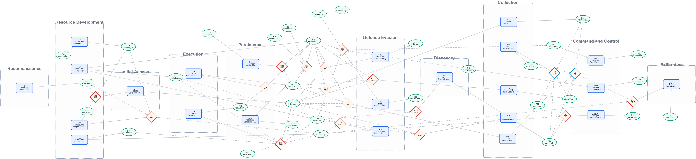

# Fact-Based Attack Dependency Graph Viewer

A research prototype for inspecting CTI-derived attack dependency graphs built from `node.xlsx`, `fact.xlsx`, `combine.xlsx`, and the source report PDF. The system visualizes technique nodes, fact preconditions, AND/OR combinations, and mechanical consistency checks over the uploaded tables.



## Dataset

The `data/` directory contains the English answer-sheet dataset used with this viewer. It is organized by report:

```text
data/
  ttps-01/
    node.xlsx
    fact.xlsx
    combine.xlsx
...
  ttps-11/
    node.xlsx
    fact.xlsx
    combine.xlsx
```

Each report folder provides the three tables needed to build a fact-based attack dependency graph. Original report links are listed in [Report Sources](data/reports.md).

## Install

```bash
npm install
```

## Run

```bash
npm run dev
```

Open the Vite URL shown in the terminal, then upload:

- `node.xlsx`
- `fact.xlsx`
- `combine.xlsx`
- The source report PDF

## Test

```bash
npm test
```

## Input Schemas

Node Table header order must be:

```text
node_id, tactic, technique_id, technique_name, behavior_summary, requirements, relationships, parsers, ref
```

Fact Table header order must be:

```text
fact_id, name, producers, consumers, is_external, level, description
```

Combine Table header order must be:

```text
combine_id, operator, members, consumer, label
```

The parser trims cell values and reads columns by name. Validation reports missing or unexpected columns, header order differences, invalid IDs, and unsupported enum values.

## Validation

The load flow runs mechanical checks over the uploaded tables before committing data to the viewer:

- Workbook schema: required headers, extra headers, and canonical header order
- Row values: `is_external`, tactic, operator, level, and ID formats
- References: missing node/fact/combine references and wrong reference types
- Consistency: parser-producer and requirement-consumer mismatches
- Combine logic: member count, missing members, invalid consumers, and cycles
- Reachability: whether nodes can be reached from external facts

## View Modes

- Nodes: inspect each technique node, requirements, parsers, related report pages, and notes
- Facts: inspect fact metadata, producers, consumers, linked pages, and notes
- Diagram: inspect the dependency graph and generated diagram view

## Workflow

1. Upload the three Excel files and the report PDF from the Load dialog.
2. Review validation errors and warnings before loading the generated viewer data.
3. Use the Nodes and Facts tabs to inspect evidence and add notes.
4. Use the Diagram tab to inspect dependency structure.
5. Export notes as JSON or CSV from the top bar.
